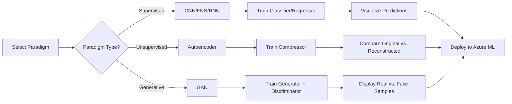

# Azure Neural Net Studio v5.0: Generative AI Edition 🧠🎨

**The Complete Deep Learning Ecosystem**

> *From Classification to Creation: A Full-Spectrum MLOps Platform Spanning Supervised, Unsupervised, and Generative AI*

[](https://www.python.org/)
[](https://pytorch.org/)
[](https://www.tensorflow.org/)
[](https://streamlit.io/)
[](https://opensource.org/licenses/MIT)

---

## 📖 Overview

**Azure Neural Net Studio v5.0** represents the pinnacle of deep learning experimentation—a complete **"Zero to Cloud"** ecosystem that transcends traditional machine learning boundaries. This release marks the evolution from mere data analysis to **data creation**, implementing the full spectrum of modern AI capabilities.

**The Journey:**
- **v1.0-v3.0:** Supervised Learning (Classification & Regression)
- **v4.0:** Multi-Modal Workbench (Images, Tabular, Time-Series)
- **v5.0:** **Generative AI Revolution** (Creation & Compression)

This edition introduces two groundbreaking paradigms:
- **Generative Adversarial Networks (GANs):** Creating synthetic data that never existed before—watching AI "dream up" realistic handwritten digits from pure random noise
- **Autoencoders:** Neural compression engines that distill 784-pixel images into 64-dimensional latent spaces and reconstruct them with remarkable fidelity

Alongside the existing **CNN, FNN, and RNN architectures**, v5.0 now covers the complete deep learning taxonomy: **Supervised Learning** (prediction), **Unsupervised Learning** (representation), and **Generative AI** (creation).

### Evolution Timeline
```
v1.0 (Genesis)        → MNIST Digit Classification
v2.0 (Dual Engine)    → PyTorch + TensorFlow Support
v3.0 (Benchmarking)   → Performance Comparison + CIFAR-10
v4.0 (Universal)      → Multi-Modal (Images + Tabular + Time-Series)
v5.0 (Generative AI)  → GANs + Autoencoders + Full AI Spectrum
```

---

## ✨ Key Features

### 🎨 **Generative AI Engine**
Train Generative Adversarial Networks to synthesize completely new data:
- **GAN Architecture:** Generator vs. Discriminator in an adversarial min-max game
- **Creative Output:** Watch random noise transform into realistic handwritten digits over 20-50 epochs
- **Visual Evolution:** Real-time visualization of the generation quality improving during training
- **Synthetic Dataset Creation:** Generate unlimited unique digit samples that look indistinguishable from real MNIST data

### 🗜️ **Neural Compression Engine**
Deploy Autoencoders for intelligent dimensionality reduction:
- **Compression Ratio:** 92% reduction (784 pixels → 64 latent features)
- **Lossy Reconstruction:** Near-perfect image restoration from compact representations
- **Latent Space Exploration:** Visualize how neural networks understand and encode visual information
- **Bottleneck Learning:** Automatic feature extraction without manual engineering

### 🌈 **The Full Spectrum**
A unified platform covering every major deep learning paradigm:

| Paradigm | Architecture | Task Type | Example |
|----------|--------------|-----------|---------|
| **Supervised** | CNN | Image Classification | CIFAR-10, MNIST |
| **Supervised** | FNN | Tabular Classification | Iris Species |
| **Supervised** | RNN | Time-Series Regression | Sine Wave Prediction |
| **Unsupervised** | Autoencoder | Dimensionality Reduction | Image Compression |
| **Generative** | GAN | Synthetic Data Creation | Digit Generation |

### ⚡ **Automated Benchmarking** *(Retained from v3.4)*
One-click performance comparison:
- **PyTorch vs. TensorFlow** accuracy head-to-head
- Training time metrics across all architectures
- Real-time loss curve visualization
- Model size and parameter counts

### ☁️ **Azure ML Integration**
Deploy any model type directly to the cloud:
- Support for `.pth` (PyTorch) and `.h5` (TensorFlow) formats
- Cross-paradigm deployment (Supervised, Unsupervised, Generative)
- Automated model registration and versioning

### 🎛️ **Interactive Control Panel**
- **Paradigm Selector:** Switch between Supervised, Unsupervised, and Generative modes
- **Live Training Metrics:** Dynamic loss/accuracy plots for all model types
- **Visual Feedback:** Watch GANs create images and Autoencoders compress/decompress in real-time
- **Architecture Viewer:** Inspect layer-by-layer structure for all 5 engines

---

## 🎯 What This Project Is About

This project represents a **comprehensive educational platform** that demonstrates the complete evolution of artificial intelligence—from analyzing existing data to **creating entirely new data from imagination**.

**Core Educational Objectives:**

1. **The Three Pillars of Modern AI:**
   - **Supervised Learning:** Teaching machines to recognize patterns (CNN/FNN/RNN)
   - **Unsupervised Learning:** Letting machines discover structure (Autoencoders)
   - **Generative AI:** Enabling machines to create (GANs)

2. **Adversarial Thinking:**
   - Understanding the GAN min-max game: Generator (artist) vs. Discriminator (critic)
   - Observing how competition drives quality in AI systems

3. **Latent Space Understanding:**
   - How neural networks compress and represent high-dimensional data
   - The bottleneck principle: forcing networks to learn efficient encodings

4. **Framework Agnosticism:**
   - Implementing identical architectures in both PyTorch and TensorFlow
   - Understanding framework-specific nuances in generative models

This is not just a code repository—it's a **journey through the history and future of AI**, from 1950s perceptrons to 2020s generative models, all accessible through a single unified interface.

---

## 🔧 What It Does

### **1. Generates New Data** 🎨✨
Creates synthetic handwritten digits that never existed in the original MNIST dataset:
- **GAN Training:** Generator learns to fool the Discriminator by producing realistic images
- **Noise-to-Image Pipeline:** Transforms 100-dimensional random vectors into 28×28 digit images
- **Quality Evolution:** Watch outputs progress from static → blurry shapes → clear digits over 50 epochs
- **Unlimited Samples:** Generate infinite unique digits after training completes

**Output:** Novel, realistic handwritten digits indistinguishable from human-written ones

### **2. Compresses Images** 🗜️
Reduces image dimensionality using neural compression:
- **Autoencoder Architecture:** 784 pixels → 64 latent features → 784 reconstructed pixels
- **Compression Ratio:** 92% size reduction while preserving visual fidelity
- **Lossy Reconstruction:** Slightly blurry outputs (acceptable trade-off for 12× compression)
- **Latent Space Visualization:** Explore how 64 numbers can encode an entire image

**Output:** Compressed latent representations + reconstructed images

### **3. Classifies Visual Inputs** 🖼️ *(Legacy - v1-v4)*
Maintains all supervised learning capabilities:
- **MNIST:** Handwritten digits (0-9) — 28×28 grayscale
- **Fashion-MNIST:** Clothing categories — 28×28 grayscale
- **CIFAR-10:** Real-world objects (Airplanes, Cars, Birds) — 32×32 RGB

**Output:** 10-class probability distributions with confidence scores

### **4. Classifies Tabular Data** 🌺 *(Legacy - v4)*
Multi-class classification on structured datasets:
- **Iris Dataset:** Flower species prediction from 4 botanical measurements
- **Features:** 150 samples, balanced 3-class problem

**Output:** Species predictions with class probabilities

### **5. Forecasts Time-Series** 📈 *(Legacy - v4)*
Sequential prediction using recurrent networks:
- **Sine Wave Regression:** Learns temporal patterns from historical data
- **RNN Architecture:** SimpleRNN captures dependencies across 50 timesteps

**Output:** Continuous value predictions for future timesteps

---

## 🧩 What Is The Logic?

### **Generative Adversarial Networks (GANs)**

The GAN framework implements a **game-theoretic approach** to generative modeling:

```python
# The Min-Max Game
while training:
    # Generator's Goal: Maximize discriminator's error
    fake_images = Generator(random_noise)
    generator_loss = -log(Discriminator(fake_images))
    
    # Discriminator's Goal: Minimize classification error
    real_loss = -log(Discriminator(real_images))
    fake_loss = -log(1 - Discriminator(fake_images))
    discriminator_loss = real_loss + fake_loss
    
    # Both networks improve through competition
```

**Key Concepts:**
1. **Adversarial Equilibrium:** Training continues until Generator produces images so realistic that Discriminator can only guess (50% accuracy)
2. **Mode Collapse Risk:** Generator may exploit weaknesses in Discriminator, producing limited variety
3. **Nash Equilibrium:** Theoretical convergence point where neither network can improve further

### **Autoencoders**

Neural compression through **bottleneck learning**:

```python
# Compression Pipeline
original_image = 784 dimensions  # 28×28 pixels

# Encoder: Force information through narrow bottleneck
latent_code = Encoder(original_image)  # 64 dimensions (92% compression)

# Decoder: Reconstruct from compressed representation
reconstructed = Decoder(latent_code)  # 784 dimensions

# Training Objective: Minimize reconstruction error
loss = MSE(original_image, reconstructed)
```

**Key Concepts:**
1. **Dimensionality Reduction:** Network learns the most important features
2. **Lossy Compression:** Some information is lost, resulting in slightly blurry reconstructions
3. **Latent Space:** The 64-dimensional bottleneck represents learned features

### **Dynamic Task Switching** *(Retained from v4)*

Runtime reconfiguration based on selected paradigm:

```python
if paradigm == "Generative AI":
    if task == "GANs":
        models = {
            'generator': GAN_Generator(latent_dim=100),
            'discriminator': GAN_Discriminator()
        }
        training_loop = adversarial_training
        
    elif task == "Autoencoders":
        model = Autoencoder(latent_dim=64)
        training_loop = reconstruction_training
        
elif paradigm == "Supervised Learning":
    # Original CNN/FNN/RNN logic (v1-v4)
    ...
```

---

## ⚙️ How Does It Work?

### **End-to-End Workflow**



### **Step-by-Step User Journey**

#### **Step 1: Paradigm Selection** 🎯
Navigate to the sidebar and choose your learning paradigm:
- **"Supervised Learning"** → Activates CNN/FNN/RNN engines
- **"Unsupervised Learning"** → Activates Autoencoder engine
- **"Generative AI"** → Activates GAN engine with specialized visualization

#### **Step 2: Task Configuration** 🛠️
Select specific task within the paradigm:
- **Generative:** "Generate Digits (GAN)" or "Compress Images (Autoencoder)"
- **Supervised:** "Classify Images (CNN)", "Classify Tabular (FNN)", "Forecast Series (RNN)"

#### **Step 3: Visual Feedback** 👁️
Experience paradigm-specific visualizations:
- **GANs:** Side-by-side comparison of real MNIST digits vs. GAN-generated fakes
- **Autoencoders:** Before/After grid showing original images and reconstructions
- **Supervised:** Standard training curves and confusion matrices

#### **Step 4: Model Training** 🚀

**Generative AI - GANs:**
```python
epochs = 50
latent_dim = 100
batch_size = 128

# Watch noise transform into digits
# Epoch 1:  Pure static
# Epoch 10: Vague shapes emerge
# Epoch 30: Recognizable digits
# Epoch 50: Indistinguishable from real data
```

**Unsupervised - Autoencoders:**
```python
epochs = 30
latent_dim = 64  # 92% compression
learning_rate = 0.001

# Reconstruction loss: 0.15 → 0.05 → 0.02
# Output: Slightly blurry but recognizable digits
```

**Expected Results:**
- **GAN:** Generator loss stabilizes around 0.7-1.0, Discriminator around 50% accuracy
- **Autoencoder:** Reconstruction MSE < 0.02 after 30 epochs
- **CNN (CIFAR-10):** 60-65% accuracy after 10 epochs (CPU baseline)
- **FNN (Iris):** 95-98% accuracy (instant training)
- **RNN (Sine Wave):** MSE < 0.001 after 50 epochs

#### **Step 5: Deployment** ☁️
Export any model type with one click:
- GAN models → `generator.pth` + `discriminator.pth`
- Autoencoder → `autoencoder.h5`
- Automatic Azure ML workspace registration

---

## 📋 What Are The Requirements?

### **System Requirements**
- **Python:** 3.10 or higher
- **RAM:** Minimum 8GB (16GB recommended for GAN training)
- **GPU:** Optional but **highly recommended** for GANs (10-20× speedup)
  - GAN training on CPU: ~5-10 min/epoch
  - GAN training on GPU: ~30 sec/epoch

### **Core Dependencies**

```txt
torch>=2.0.0
tensorflow>=2.13.0
streamlit>=1.28.0
scikit-learn>=1.3.0
pandas>=2.0.0
numpy>=1.24.0
matplotlib>=3.7.0
seaborn>=0.12.0
pillow>=10.0.0
azure-ai-ml>=1.11.0
azureml-core>=1.53.0
```

### **Optional Dependencies**
- `tensorboard>=2.13.0` — Enhanced GAN training visualization
- `torchvision>=0.15.0` — Additional datasets
- `jupyter>=1.0.0` — Notebook experimentation

---

## 🏛️ Technical Architecture

```
┌─────────────────────────────────────────────────────────────────────┐
│                       STREAMLIT UI LAYER                            │
│  ┌────────────┐  ┌────────────┐  ┌────────────┐  ┌────────────┐   │
│  │ Supervised │  │Unsupervised│  │ Generative │  │ Benchmark  │   │
│  │   Panel    │  │   Panel    │  │   Panel    │  │   Panel    │   │
│  └────────────┘  └────────────┘  └────────────┘  └────────────┘   │
└─────────────────────────┬───────────────────────────────────────────┘
                          │
              ┌───────────┴───────────┐
              │  Paradigm Router      │
              │  (Supervised/Unsu/Gen)│
              └───────────┬───────────┘
                          │
        ┌─────────────────┼─────────────────────────┐
        │                 │                         │
   ┌────▼─────┐     ┌────▼─────┐            ┌─────▼──────┐
   │SUPERVISED│     │UNSUPERV. │            │ GENERATIVE │
   │ ENGINES  │     │ ENGINE   │            │  ENGINES   │
   └────┬─────┘     └────┬─────┘            └─────┬──────┘
        │                │                         │
   ┌────┼─────┐          │                    ┌────┼─────┐
   │    │     │          │                    │         │
┌──▼─┐ ┌▼──┐ ┌▼──┐   ┌──▼──────┐       ┌────▼────┐ ┌──▼─────┐
│CNN │ │FNN│ │RNN│   │Autoencoder│      │Generator│ │Discrim.│
│    │ │   │ │   │   │           │      │         │ │        │
│CIFARMNIST│Sine│   │  64-dim   │      │ Latent  │ │Real/Fake│
│-10 │ │Iris│Wave│   │ Bottleneck│      │  100    │ │Classifier│
└────┘ └───┘ └───┘   └───────────┘      └─────────┘ └────────┘
   │      │     │          │                  │          │
   └──────┼─────┼──────────┼──────────────────┼──────────┘
          │     │          │                  │
          └─────┴──────────┴──────────────────┘
                          │
              ┌───────────▼───────────┐
              │   Dual Framework      │
              │  PyTorch / TensorFlow │
              └───────────┬───────────┘
                          │
              ┌───────────▼───────────┐
              │   Azure ML Deployer   │
              └───────────────────────┘
```

### **Component Interactions**

1. **UI Layer:** Streamlit widgets capture paradigm and task selections
2. **Paradigm Router:** Dispatches requests to appropriate engine category
3. **Engines:** Execute specialized training loops:
   - **Supervised:** Standard backpropagation with labels
   - **Unsupervised:** Reconstruction loss minimization
   - **Generative:** Adversarial training (dual optimizer)
4. **Deployer:** Packages models and pushes to Azure ML

---

## 📊 Model Specifications

### **1. GAN Generator (Generative AI)**
```python
Input: Random Noise (latent_dim=100)
Dense(100, 256)
LeakyReLU(0.2)
BatchNorm1d(256)

Dense(256, 512)
LeakyReLU(0.2)
BatchNorm1d(512)

Dense(512, 1024)
LeakyReLU(0.2)
BatchNorm1d(1024)

Dense(1024, 784)   # Output: 28×28 image
Tanh()             # Scale to [-1, 1]
```
**Parameters:** ~1.4M  
**Training Time (CPU):** ~8 min/epoch  
**Training Time (GPU):** ~30 sec/epoch

---

### **2. GAN Discriminator (Generative AI)**
```python
Input: Image (784 pixels, flattened 28×28)
Dense(784, 512)
LeakyReLU(0.2)
Dropout(0.3)

Dense(512, 256)
LeakyReLU(0.2)
Dropout(0.3)

Dense(256, 1)      # Output: Real/Fake probability
Sigmoid()
```
**Parameters:** ~660K  
**Training Time:** Coupled with Generator

---

### **3. Autoencoder (Unsupervised Learning)**
```python
# Encoder
Input(784)         # 28×28 image
Dense(128)
ReLU()
Dense(64)          # Bottleneck: 92% compression
ReLU()

# Decoder
Dense(128)
ReLU()
Dense(784)         # Reconstructed image
Sigmoid()          # Scale to [0, 1]
```
**Parameters:** ~203K  
**Compression Ratio:** 12.25× (784 → 64)  
**Training Time (CPU):** ~30 sec/epoch

---

### **4. CNN Architecture** *(Supervised - v1-v4)*
```python
Conv2D(3, 32, kernel_size=3, padding=1)
ReLU()
MaxPool2D(kernel_size=2, stride=2)

Conv2D(32, 64, kernel_size=3, padding=1)
ReLU()
MaxPool2D(kernel_size=2, stride=2)

Flatten()
Dense(4096, 128)
ReLU()
Dense(128, 10)
Softmax()
```
**Parameters:** ~530K

---

### **5. FNN Architecture** *(Supervised - v4)*
```python
Input(4)
Dense(64)
ReLU()
Dense(32)
ReLU()
Dense(3)
Softmax()
```
**Parameters:** ~2.3K

---

### **6. RNN Architecture** *(Supervised - v4)*
```python
Input(sequence_length=50, features=1)
SimpleRNN(units=128, return_sequences=False)
Dense(1)
```
**Parameters:** ~16.5K

---

## 🛠️ Tech Stack

| Category | Technologies |
|----------|-------------|
| **Deep Learning Frameworks** | PyTorch 2.0+, TensorFlow 2.13+ |
| **Web Framework** | Streamlit 1.28+ |
| **Data Science** | Scikit-Learn, Pandas, NumPy |
| **Visualization** | Matplotlib, Seaborn, Plotly |
| **Cloud Platform** | Azure Machine Learning |
| **Version Control** | Git |
| **Environment Management** | Python venv / Conda |

---

## 📦 Install Dependencies

Create a `requirements.txt` file:

```txt
# Deep Learning
torch==2.0.1
torchvision==0.15.2
tensorflow==2.13.0

# Web Interface
streamlit==1.28.1

# Data Processing
scikit-learn==1.3.0
pandas==2.0.3
numpy==1.24.3

# Visualization
matplotlib==3.7.2
seaborn==0.12.2

# Azure Integration
azure-ai-ml==1.11.1
azureml-core==1.53.0

# Utilities
pillow==10.0.0
```

Install all dependencies:
```bash
pip install -r requirements.txt
```

---

## 🚀 Installation and Setup

### **Step 1: Clone the Repository**
```bash
git clone https://github.com/WSalim2024/MCert-AzureNeuralNet-Studio.git
cd MCert-AzureNeuralNet-Studio
```

### **Step 2: Create Virtual Environment**
```bash
# Using venv
python -m venv venv

# Activate (Windows)
venv\Scripts\activate

# Activate (macOS/Linux)
source venv/bin/activate
```

### **Step 3: Install Dependencies**
```bash
pip install --upgrade pip
pip install -r requirements.txt
```

### **Step 4: Configure Azure Credentials** *(Optional)*
For cloud deployment functionality:
```bash
# Set environment variables
export AZURE_SUBSCRIPTION_ID="your-subscription-id"
export AZURE_RESOURCE_GROUP="your-resource-group"
export AZURE_WORKSPACE_NAME="your-workspace-name"
```

Or create a `.env` file:
```env
AZURE_SUBSCRIPTION_ID=xxxx-xxxx-xxxx
AZURE_RESOURCE_GROUP=ml-resources
AZURE_WORKSPACE_NAME=neural-net-studio
```

### **Step 5: Verify Installation**
```bash
python -c "import torch, tensorflow, streamlit; print('✅ All dependencies installed')"
```

---

## 🎮 Launching the Cockpit

Start the Streamlit application:

```bash
streamlit run app.py
```

The dashboard will open automatically at:
```
Local URL:    http://localhost:8501
Network URL:  http://192.168.x.x:8501
```

**First Launch Checklist:**
- ✅ Sidebar displays paradigm selector (Supervised/Unsupervised/Generative)
- ✅ Default paradigm is "Supervised Learning"
- ✅ Framework selector shows PyTorch/TensorFlow toggle
- ✅ Dataset downloader initializes MNIST/CIFAR-10

---

## 📖 User Guide

### **Scenario A: Generate Synthetic Digits with GANs** 🎨✨

**Objective:** Train a GAN to create realistic handwritten digits from random noise

1. **Select Paradigm:**
   - Sidebar → **"Generative AI"**
   - Task → **"Generate Digits (GAN)"**

2. **Configure Training:**
   ```
   Framework: PyTorch
   Epochs: 50
   Latent Dimension: 100
   Learning Rate: 0.0002
   Batch Size: 128
   ```

3. **Understand the Architecture:**
   - **Generator:** Transforms 100-D noise vectors into 784-pixel images
   - **Discriminator:** Binary classifier distinguishing real from fake

4. **Start Training:**
   - Click **"Train GAN"**
   - **Epoch 1-10:** Generator produces random static
   - **Epoch 10-25:** Vague digit-like shapes emerge
   - **Epoch 25-40:** Clear but imperfect digits
   - **Epoch 40-50:** Realistic, diverse digits

5. **Monitor Progress:**
   - **Generator Loss:** Should stabilize around 0.7-1.5
   - **Discriminator Loss:** Should hover around 0.6-0.8
   - **Discriminator Accuracy:** Target ~50% (can't distinguish real from fake)

6. **Visual Inspection:**
   - View grid of 16 generated samples
   - Compare against real MNIST digits
   - Observe diversity in styles (thin, thick, slanted)

7. **Common Issues:**
   - **Mode Collapse:** All digits look the same → Restart with lower learning rate
   - **Discriminator Wins:** Generated images stay noisy → Increase Generator capacity
   - **Generator Wins:** Discriminator accuracy drops to 0% → Increase Discriminator learning rate

**Expected Outcome:** High-quality synthetic digits indistinguishable from real MNIST

---

### **Scenario B: Compress Images with Autoencoders** 🗜️

**Objective:** Learn neural compression to reduce image size by 92%

1. **Select Paradigm:**
   - Sidebar → **"Unsupervised Learning"**
   - Task → **"Compress Images (Autoencoder)"**

2. **Configure Training:**
   ```
   Framework: TensorFlow
   Epochs: 30
   Latent Dimension: 64  # 784 → 64 (92% compression)
   Learning Rate: 0.001
   Batch Size: 256
   ```

3. **Understand the Process:**
   - **Encoder:** Compresses 784 pixels → 64 latent features
   - **Bottleneck:** Forces network to learn efficient representation
   - **Decoder:** Reconstructs 64 features → 784 pixels

4. **Start Training:**
   - Click **"Train Autoencoder"**
   - Watch reconstruction loss decrease: 0.15 → 0.05 → 0.02

5. **Evaluate Results:**
   - **Original vs. Reconstructed Grid:** Side-by-side comparison of 16 images
   - **Reconstruction MSE:** Target < 0.03 (acceptable blur)
   - **Visual Quality:** Digits recognizable but slightly blurry

6. **Explore Latent Space:**
   - View the 64-dimensional encoding for sample images
   - Notice how similar digits have similar encodings

7. **Practical Applications:**
   - **Image Compression:** Store images 12× more efficiently
   - **Denoising:** Train on noisy images, reconstruct clean versions
   - **Anomaly Detection:** High reconstruction error = unusual input

**Expected Outcome:** 92% compression with visually acceptable reconstruction quality

---

### **Scenario C: Classic Supervised Learning** 🖼️🌺📈

**Objective:** Train traditional CNN/FNN/RNN models (v1-v4 functionality)

#### **C1: Image Classification (CNN)**

1. **Select Paradigm:**
   - Sidebar → **"Supervised Learning"**
   - Task → **"Classify Images"**
   - Dataset → **"CIFAR-10"**

2. **Configure & Train:**
   ```
   Framework: PyTorch
   Epochs: 10
   Learning Rate: 0.001
   Batch Size: 64
   ```

3. **Expected Results:**
   - Final accuracy: **~60-65%** on test set (CPU baseline)
   - Training time: ~15 min/epoch (CPU), ~2 min/epoch (GPU)

#### **C2: Tabular Classification (FNN)**

1. **Select Task:**
   - **"Classify Tabular Data"** → Iris Dataset

2. **Expected Results:**
   - Final accuracy: **~97%** (instant training)

#### **C3: Time-Series Regression (RNN)**

1. **Select Task:**
   - **"Forecast Time-Series"** → Sine Wave

2. **Expected Results:**
   - Final MSE: **< 0.001** after 50 epochs

---

## ⚠️ Restrictions and Limitations

### **Generative AI Challenges**

#### **GANs - Inherent Instability**
- **Mode Collapse:** Generator may produce limited variety (all 1s, all 7s)
  - **Solution:** Restart training, adjust learning rates, add noise to Discriminator inputs
- **Training Divergence:** Losses may oscillate wildly without convergence
  - **Solution:** Reduce learning rates, use gradient clipping
- **Discriminator Dominance:** Generator stuck producing noise
  - **Solution:** Train Generator 2× per Discriminator update
- **Generator Dominance:** Discriminator accuracy drops to 0%
  - **Solution:** Add dropout, reduce Generator capacity

**Important:** GAN training is inherently unstable. Expect 20-30% of training runs to fail. This is normal and reflects the cutting-edge nature of adversarial learning.

#### **Autoencoders - Lossy Compression**
- **Blurry Reconstructions:** 92% compression inherently loses information
  - **Trade-off:** Sharper images require larger latent dimensions (less compression)
- **Fine Detail Loss:** Small features (dots, thin lines) may disappear
  - **Solution:** Increase latent_dim to 128 or 256 for higher fidelity

### **Computational Constraints**
- **GAN Training:** Extremely resource-intensive
  - **CPU:** 5-10 min/epoch (impractical for 50+ epochs)
  - **GPU:** 30 sec/epoch (strongly recommended)
- **Memory Requirements:**
  - **GANs:** Minimum 12GB RAM (16GB recommended)
  - **Autoencoders:** 8GB sufficient

### **Framework Differences**
- **PyTorch vs. TensorFlow:** GANs show greater variance (5-10% accuracy difference)
- **Reproducibility:** Adversarial training is non-deterministic even with fixed seeds

### **Dataset Limitations**
- **MNIST Only:** Current GAN/Autoencoder implementations trained on MNIST
- **Future Work:** Extend to CIFAR-10 (requires architectural modifications)

### **Azure Deployment**
- **Model Size:** GAN generators (1.4MB) deploy smoothly, full GAN pairs (2.1MB) may require compression

---

## ⚖️ Disclaimer

**EDUCATIONAL USE ONLY**

This project is developed strictly for **academic and learning purposes**. It is intended to demonstrate:
- Generative Adversarial Network principles and training dynamics
- Unsupervised learning through autoencoders
- Neural compression and latent space representations
- Multi-paradigm MLOps pipeline construction
- Cloud deployment workflows for diverse model types

**Not Suitable For:**
- Production-grade generative applications without extensive tuning
- Mission-critical systems requiring 99.9% uptime
- Medical, financial, or safety-critical decision-making
- Commercial deployment of synthetic data without bias testing
- Malicious use (deepfakes, synthetic identity fraud)

**Generative AI Ethics:**
- Synthetic data can perpetuate biases present in training sets
- Generated content should be clearly labeled as AI-created
- Consider societal implications of realistic synthetic media

**Model Performance:**
- GAN outputs may occasionally produce offensive or nonsensical results
- Autoencoder reconstructions are approximations, not perfect copies
- Real-world performance varies significantly based on:
  - Data quality and quantity
  - Hyperparameter tuning
  - Hardware capabilities (GPU vs. CPU)
  - Training stability (GANs)

**Security Notice:**
- Do not commit Azure credentials to version control
- Generated data may leak training set characteristics
- Regularly update dependencies to patch security vulnerabilities

**Liability:**
The author assumes no responsibility for:
- Quality or safety of generated synthetic data
- Model predictions or deployment outcomes
- Misuse of generative capabilities
- Data loss or corruption
- Security breaches due to misconfiguration
- Cloud service costs incurred

---

## 👨‍💻 Author

<div align="center">

### **Waqar Salim**

*Master's Student & IT Professional*

---

[](https://github.com/WSalim2024)
[](https://www.linkedin.com/in/waqar-salim/)

---

**Special Thanks:**
- Ian Goodfellow et al. for pioneering GANs (2014)
- Geoffrey Hinton for autoencoder foundations
- PyTorch & TensorFlow development teams
- Streamlit for the exceptional web framework
- Azure ML team for cloud integration tools
- Open-source ML community

## 🙏 Contributing

Contributions are welcome! If you'd like to enhance the project:

1. Fork the repository
2. Create a feature branch (`git checkout -b feature/YourFeature`)
3. Commit changes (`git commit -m 'Add YourFeature'`)
4. Push to branch (`git push origin feature/YourFeature`)
5. Open a Pull Request

**High-Priority Contribution Ideas:**
- **Conditional GANs:** Generate specific digit classes on demand
- **Variational Autoencoders (VAEs):** Probabilistic latent spaces
- **StyleGAN Integration:** High-resolution image generation
- **CIFAR-10 GANs:** Extend generative capabilities to color images
- **Progressive Growing:** Stable training for larger images
- **Wasserstein GAN:** More stable adversarial training
- **Model Explainability:** SHAP/LIME for generative models

---

**Known Issues:**
- GAN training may crash on systems with <8GB RAM
- Autoencoder reconstructions show artifacts on high-frequency patterns
- Azure deployment may timeout for large GAN models

---

<div align="center">

**Built with ❤️ for the Deep Learning Community**

*"From classification to creation, from analysis to imagination—the complete AI spectrum in one platform."*

---

### 🎨 **The Future is Generative** ✨

</div>
