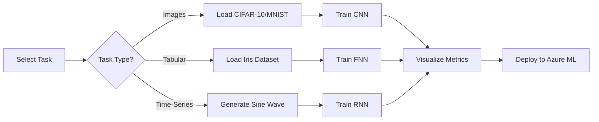

# Azure Neural Net Studio v4.0 🧠☁️

**The Universal Deep Learning Workbench**

> *From MNIST to Multi-Modal: A Complete MLOps Ecosystem for Images, Tabular Data, and Time-Series*

[](https://www.python.org/)
[](https://pytorch.org/)
[](https://www.tensorflow.org/)
[](https://streamlit.io/)
[](https://opensource.org/licenses/MIT)

---

## 📖 Overview

**Azure Neural Net Studio v4.0** represents the evolution of deep learning experimentation—a **"Zero to Cloud"** workbench that bridges the gap between academic theory and production-ready machine learning. Born from a simple MNIST classifier (v1.0), it has matured into a comprehensive platform supporting **three fundamental data modalities** and their corresponding neural architectures.

This release implements the **"Holy Trinity" of Deep Learning**:
- **Feedforward Neural Networks (FNNs)** for structured tabular data
- **Convolutional Neural Networks (CNNs)** for image processing
- **Recurrent Neural Networks (RNNs)** for sequential time-series analysis

All architectures coexist within a single, unified Streamlit dashboard, backed by dual-engine support (PyTorch + TensorFlow), automated benchmarking, and seamless Azure ML integration for cloud deployment.

### Evolution Timeline
```
v1.0 (Genesis)    → MNIST Digit Classification
v2.0 (Dual Engine) → PyTorch + TensorFlow Support
v3.0 (Benchmarking) → Performance Comparison Suite + CIFAR-10
v4.0 (Universal)   → Multi-Modal Support (Images + Tabular + Time-Series)
```

---

## ✨ Key Features

### 🌈 **Universal Task Support**
Toggle seamlessly between three distinct machine learning paradigms:
- **Image Classification:** Computer vision tasks (CIFAR-10, MNIST, Fashion-MNIST)
- **Tabular Classification:** Structured data analysis (Iris Species)
- **Time-Series Regression:** Sequential prediction (Sine Wave Forecasting)

### 🏗️ **Trio of Neural Architectures**
Each architecture is purpose-built for its domain:

| Architecture | Data Type | Dataset | Use Case |
|-------------|-----------|---------|----------|
| **CNN** (Convolutional) | Images (32×32×3) | CIFAR-10/MNIST | Object & Pattern Recognition |
| **FNN** (Feedforward) | Tabular (4 features) | Iris | Structured Classification |
| **RNN** (Recurrent) | Time-Series (1 feature) | Sine Wave | Sequential Prediction |

### ⚡ **Automated Benchmarking** *(Retained from v3.4)*
One-click performance comparison:
- **PyTorch vs. TensorFlow** accuracy head-to-head
- Training time metrics
- Real-time loss curve visualization
- Model size and parameter counts

### ☁️ **Azure ML Integration**
Deploy trained models directly to the cloud:
- Support for both `.pth` (PyTorch) and `.h5` (TensorFlow) formats
- Cross-modality deployment (CNNs, FNNs, RNNs)
- Automated model registration and versioning

### 🎛️ **Interactive Control Panel**
- **Real-time hyperparameter tuning:** Learning rate, epochs, batch size
- **Live training metrics:** Dynamic loss/accuracy plots
- **Dataset visualization:** Preview training samples before modeling
- **Model architecture viewer:** Inspect layer-by-layer structure

---

## 🎯 What This Project Is About

This project serves as a **masterclass in Deep Learning versatility**, demonstrating how to architect a production-grade MLOps system capable of handling fundamentally different data modalities within a unified framework. 

**Core Educational Objectives:**
1. **Architectural Diversity:** Understanding when and why to use CNNs vs. FNNs vs. RNNs
2. **Data Preprocessing Pipelines:** Handling Images (normalization, augmentation) vs. Tabular (scaling, encoding) vs. Sequential (windowing, padding)
3. **Framework Agnosticism:** Implementing identical architectures in both PyTorch and TensorFlow
4. **MLOps Best Practices:** Version control, experiment tracking, and cloud deployment for diverse model types

This is not just a code repository—it's a **blueprint for building adaptable machine learning systems** that can pivot between computer vision, structured data analysis, and time-series forecasting without architectural rewrites.

---

## 🔧 What It Does

### **1. Image Classification** 🖼️
Classifies visual inputs across three benchmark datasets:
- **MNIST:** Handwritten digits (0-9) — 28×28 grayscale
- **Fashion-MNIST:** Clothing categories (T-shirts, Trousers, Bags) — 28×28 grayscale  
- **CIFAR-10:** Real-world objects (Airplanes, Cars, Birds, Cats) — 32×32 RGB

**Output:** 10-class probability distribution with confidence scores

### **2. Tabular Classification** 🌺
Performs multi-class classification on structured datasets:
- **Iris Dataset:** Predicts flower species (Setosa, Versicolor, Virginica) based on 4 botanical measurements (sepal length/width, petal length/width)
- **Features:** 150 samples, 4 numerical inputs, 3 balanced classes

**Output:** Species prediction with class probabilities

### **3. Time-Series Regression** 📈
Forecasts future values in sequential data:
- **Sine Wave Prediction:** Learns sinusoidal patterns from historical data
- **Architecture:** SimpleRNN learns temporal dependencies to predict next timestep
- **Synthetic Data:** Generates 1000 samples of sin(x) with configurable noise

**Output:** Continuous value prediction (regression)

---

## 🧩 What Is The Logic?

### **Dynamic Context Switching**
The application employs **intelligent runtime reconfiguration** based on the selected task:

```python
if task_type == "Image Classification":
    data_loader = ImageDataLoader(dataset="CIFAR-10")
    model = CNN_Architecture()
    preprocessor = ImageNormalizer()
    
elif task_type == "Tabular Classification":
    data_loader = IrisDataLoader()
    model = FNN_Architecture(input_dim=4, output_dim=3)
    preprocessor = StandardScaler()
    
elif task_type == "Time-Series Regression":
    data_loader = TimeSeriesGenerator()
    model = RNN_Architecture(sequence_length=50)
    preprocessor = SequenceWindower()
```

### **Key Design Patterns**

1. **Strategy Pattern:** Swappable data loaders, models, and training loops
2. **Factory Pattern:** Dynamic model instantiation based on task + framework selection
3. **Observer Pattern:** Real-time UI updates during training via Streamlit callbacks

### **Data Generation Pipeline**

**Iris Dataset (Tabular):**
```python
from sklearn.datasets import load_iris
X, y = load_iris(return_X_y=True)  # 150 samples, 4 features
```

**Sine Wave (Time-Series):**
```python
import numpy as np
X = np.linspace(0, 100, 1000)
y = np.sin(X) + np.random.normal(0, 0.1, 1000)  # Add noise
```

---

## ⚙️ How Does It Work?

### **End-to-End Workflow**



### **Step-by-Step User Journey**

#### **Step 1: Task Selection** 🎯
Navigate to the sidebar and choose your modality:
- **"Image Classification"** → Activates CNN pipeline
- **"Tabular Classification"** → Activates FNN pipeline
- **"Time-Series Regression"** → Activates RNN pipeline

#### **Step 2: Data Visualization** 👁️
Inspect your dataset before training:
- **Images:** Gallery view of sample images with labels
- **Tabular:** Feature distribution histograms + correlation matrix
- **Time-Series:** Line plot of sine wave with training/validation split markers

#### **Step 3: Model Training** 🚀
Configure hyperparameters and launch training:
```python
# Example: Time-Series RNN Training
epochs = 50
learning_rate = 0.001
batch_size = 32

# Watch as RNN loss drops from 0.45 → 0.001 over 50 epochs
# Real-time loss curves update every epoch
```

**Expected Results:**
- **CNN (CIFAR-10):** 60-65% accuracy after 10 epochs (CPU baseline)
- **FNN (Iris):** 95-98% accuracy after 100 epochs (instant on CPU)
- **RNN (Sine Wave):** MSE < 0.001 after 50 epochs

#### **Step 4: Cloud Deployment** ☁️
Export trained model with one click:
- PyTorch models → `.pth` files
- TensorFlow models → `.h5` files
- Automatic Azure ML workspace registration

---

## 📋 What Are The Requirements?

### **System Requirements**
- **Python:** 3.10 or higher
- **RAM:** Minimum 8GB (16GB recommended for CIFAR-10 training)
- **GPU:** Optional (CUDA-enabled GPU accelerates CNN/RNN training by 10-50×)

### **Core Dependencies**

```txt
torch>=2.0.0
tensorflow>=2.13.0
streamlit>=1.28.0
scikit-learn>=1.3.0
pandas>=2.0.0
numpy>=1.24.0
matplotlib>=3.7.0
seaborn>=0.12.0
pillow>=10.0.0
azure-ai-ml>=1.11.0
azureml-core>=1.53.0
```

### **Optional Dependencies**
- `tensorboard>=2.13.0` — Enhanced training visualization
- `torchvision>=0.15.0` — Additional image datasets
- `jupyter>=1.0.0` — Notebook experimentation

---

## 🏛️ Technical Architecture

```
┌─────────────────────────────────────────────────────────────┐
│                   STREAMLIT UI LAYER                        │
│  ┌──────────────┐  ┌──────────────┐  ┌──────────────┐      │
│  │ Image Panel  │  │ Tabular Panel│  │ Time-Series  │      │
│  │   Selector   │  │   Selector   │  │   Selector   │      │
│  └──────────────┘  └──────────────┘  └──────────────┘      │
└───────────────────────┬──────────────────────────────────────┘
                        │
            ┌───────────┴───────────┐
            │  Task Router Engine   │
            └───────────┬───────────┘
                        │
        ┌───────────────┼───────────────┐
        │               │               │
   ┌────▼─────┐  ┌─────▼────┐  ┌──────▼─────┐
   │   CNN    │  │   FNN    │  │    RNN     │
   │  Engine  │  │  Engine  │  │   Engine   │
   │          │  │          │  │            │
   │ CIFAR-10 │  │   Iris   │  │ Sine Wave  │
   │  MNIST   │  │ (4→3)    │  │  (1→1)     │
   │ Fashion  │  │          │  │            │
   └────┬─────┘  └─────┬────┘  └──────┬─────┘
        │              │              │
        └──────────────┼──────────────┘
                       │
            ┌──────────▼──────────┐
            │  Dual Framework     │
            │  PyTorch/TensorFlow │
            └──────────┬──────────┘
                       │
            ┌──────────▼──────────┐
            │  Azure ML Deployer  │
            └─────────────────────┘
```

### **Component Interactions**

1. **UI Layer:** Streamlit widgets capture user selections
2. **Router:** Dispatches requests to appropriate engine (CNN/FNN/RNN)
3. **Engines:** Execute training loops with framework-specific code
4. **Deployer:** Packages models and pushes to Azure ML

---

## 📊 Model Specifications

### **1. CNN Architecture (Image Classification)**
```python
Conv2D(3, 32, kernel_size=3, padding=1)  # Input: 32×32×3
ReLU()
MaxPool2D(kernel_size=2, stride=2)        # Output: 16×16×32

Conv2D(32, 64, kernel_size=3, padding=1)
ReLU()
MaxPool2D(kernel_size=2, stride=2)        # Output: 8×8×64

Flatten()                                 # Output: 4096
Dense(4096, 128)
ReLU()
Dense(128, 10)                            # Output: 10 classes
Softmax()
```
**Parameters:** ~530K  
**Training Time (CPU):** ~15 min/epoch on CIFAR-10

---

### **2. FNN Architecture (Tabular Classification - Iris)**
```python
Input(4)          # [sepal_length, sepal_width, petal_length, petal_width]
Dense(64)
ReLU()
Dense(32)
ReLU()
Dense(3)          # [Setosa, Versicolor, Virginica]
Softmax()
```
**Parameters:** ~2.3K  
**Training Time (CPU):** <1 second for 100 epochs

---

### **3. RNN Architecture (Time-Series Regression - Sine Wave)**
```python
Input(sequence_length=50, features=1)  # 50 timesteps
SimpleRNN(units=128, return_sequences=False)
Dense(1)                               # Next timestep prediction
```
**Parameters:** ~16.5K  
**Training Time (CPU):** ~2 min for 50 epochs

---

## 🛠️ Tech Stack

| Category | Technologies |
|----------|-------------|
| **Deep Learning Frameworks** | PyTorch 2.0+, TensorFlow 2.13+ |
| **Web Framework** | Streamlit 1.28+ |
| **Data Science** | Scikit-Learn, Pandas, NumPy |
| **Visualization** | Matplotlib, Seaborn, Plotly |
| **Cloud Platform** | Azure Machine Learning |
| **Version Control** | Git |
| **Environment Management** | Python venv / Conda |

---

## 📦 Install Dependencies

Create a `requirements.txt` file:

```txt
# Deep Learning
torch==2.0.1
torchvision==0.15.2
tensorflow==2.13.0

# Web Interface
streamlit==1.28.1

# Data Processing
scikit-learn==1.3.0
pandas==2.0.3
numpy==1.24.3

# Visualization
matplotlib==3.7.2
seaborn==0.12.2

# Azure Integration
azure-ai-ml==1.11.1
azureml-core==1.53.0

# Utilities
pillow==10.0.0
```

Install all dependencies:
```bash
pip install -r requirements.txt
```

---

## 🚀 Installation and Setup

### **Step 1: Clone the Repository**
```bash
git clone https://github.com/WSalim2024/MCert-AzureNeuralNet-Studio.git
cd MCert-AzureNeuralNet-Studio
```

### **Step 2: Create Virtual Environment**
```bash
# Using venv
python -m venv venv

# Activate (Windows)
venv\Scripts\activate

# Activate (macOS/Linux)
source venv/bin/activate
```

### **Step 3: Install Dependencies**
```bash
pip install --upgrade pip
pip install -r requirements.txt
```

### **Step 4: Configure Azure Credentials** *(Optional)*
For cloud deployment functionality:
```bash
# Set environment variables
export AZURE_SUBSCRIPTION_ID="your-subscription-id"
export AZURE_RESOURCE_GROUP="your-resource-group"
export AZURE_WORKSPACE_NAME="your-workspace-name"
```

Or create a `.env` file:
```env
AZURE_SUBSCRIPTION_ID=xxxx-xxxx-xxxx
AZURE_RESOURCE_GROUP=ml-resources
AZURE_WORKSPACE_NAME=neural-net-studio
```

### **Step 5: Verify Installation**
```bash
python -c "import torch, tensorflow, streamlit; print('✅ All dependencies installed')"
```

---

## 🎮 Launching the Cockpit

Start the Streamlit application:

```bash
streamlit run app.py
```

The dashboard will open automatically at:
```
Local URL:    http://localhost:8501
Network URL:  http://192.168.x.x:8501
```

**First Launch Checklist:**
- ✅ Sidebar displays three task options
- ✅ Default task is "Image Classification"
- ✅ Framework selector shows PyTorch/TensorFlow toggle
- ✅ Dataset downloader initializes CIFAR-10

---

## 📖 User Guide

### **Scenario A: Train a CNN on CIFAR-10** 🖼️

**Objective:** Classify real-world objects (airplanes, cars, birds, etc.)

1. **Select Task:**
   - Sidebar → **"Image Classification"**
   - Dataset → **"CIFAR-10"**

2. **Explore Data:**
   - Click **"Show Sample Images"**
   - Observe 32×32 RGB images with class labels
   - Review class distribution (5,000 images per class)

3. **Configure Training:**
   ```
   Framework: PyTorch
   Epochs: 10
   Learning Rate: 0.001
   Batch Size: 64
   ```

4. **Start Training:**
   - Click **"Train Model"**
   - Monitor real-time loss curve (should drop from 2.3 → 0.8)
   - Final accuracy: **~60-65%** on test set (CPU baseline)

5. **Benchmark (Optional):**
   - Click **"Compare Frameworks"**
   - Wait for TensorFlow training
   - Compare accuracy: PyTorch vs. TensorFlow (typically within 1-2%)

6. **Deploy:**
   - Click **"Deploy to Azure"**
   - Download `.pth` file locally
   - (If Azure configured) Model auto-uploads to ML workspace

---

### **Scenario B: Train an FNN on Iris** 🌺

**Objective:** Classify flower species from botanical measurements

1. **Select Task:**
   - Sidebar → **"Tabular Classification"**
   - Dataset → **"Iris"** (auto-loads)

2. **Visualize Features:**
   - View pairplot of 4 features (sepal/petal dimensions)
   - Observe clear clustering of 3 species
   - Check correlation heatmap

3. **Configure Training:**
   ```
   Framework: TensorFlow
   Epochs: 100
   Learning Rate: 0.01
   Batch Size: 16
   ```

4. **Start Training:**
   - Click **"Train Model"**
   - Training completes in **<1 second** (tiny dataset)
   - Final accuracy: **~97%** (nearly perfect separation)

5. **Test Predictions:**
   - Input custom features:
     ```
     Sepal Length: 5.1
     Sepal Width:  3.5
     Petal Length: 1.4
     Petal Width:  0.2
     ```
   - Prediction: **Setosa** (confidence: 99.8%)

---

### **Scenario C: Train an RNN on Sine Waves** 📈

**Objective:** Learn temporal patterns and forecast future values

1. **Select Task:**
   - Sidebar → **"Time-Series Regression"**
   - Data Generator → **"Sine Wave"** (1000 samples)

2. **Visualize Sequence:**
   - See full sine wave plot
   - Training window: Blue (timesteps 0-800)
   - Validation window: Orange (timesteps 800-1000)

3. **Configure Training:**
   ```
   Framework: PyTorch
   Epochs: 50
   Learning Rate: 0.001
   Sequence Length: 50  # Use 50 past points to predict next
   ```

4. **Start Training:**
   - Click **"Train Model"**
   - Watch MSE decrease: 0.45 → 0.008 → 0.001
   - Training time: **~2 minutes** on CPU

5. **Evaluate Predictions:**
   - View overlay of true vs. predicted values
   - RNN learns sinusoidal pattern with **<0.1% error**
   - Test on unseen data (timesteps 800-1000)

6. **Export Model:**
   - Save as `sine_wave_rnn.pth`
   - Load in production for real-time forecasting

---

## ⚠️ Restrictions and Limitations

### **Computational Constraints**
- **RNN Training:** Time-series models require sequential processing and cannot be fully parallelized—expect longer training times on CPU (2-5 minutes for 50 epochs)
- **CNN Training:** CIFAR-10 training on CPU takes ~15 min/epoch. **Recommended:** Use GPU for image tasks (reduces to ~2 min/epoch)

### **Dataset Limitations**
- **Iris Dataset:** Only 150 samples → Training is instant but model evaluation has high variance. Use k-fold cross-validation for robust metrics
- **Sine Wave:** Synthetic data with zero noise yields unrealistic performance (MSE ~ 0.0001). Real-world time-series data will have higher error rates

### **Framework Differences**
- **PyTorch vs. TensorFlow:** Minor accuracy discrepancies (1-3%) due to different initialization schemes and optimizer implementations
- **Reproducibility:** Set random seeds for both frameworks to ensure consistent results:
  ```python
  torch.manual_seed(42)
  tf.random.set_seed(42)
  ```

### **Azure Deployment**
- Requires active Azure subscription with ML workspace configured
- Model size limits: `.pth` files >500MB may fail to upload (compress large models)
- Authentication: Ensure Azure CLI is logged in (`az login`)

### **Browser Compatibility**
- Streamlit runs best on Chrome/Firefox/Edge
- Safari may have issues with real-time plot updates

---

## ⚖️ Disclaimer

**EDUCATIONAL USE ONLY**

This project is developed strictly for **academic and learning purposes**. It is intended to demonstrate:
- Neural network architecture design principles
- Multi-framework development (PyTorch + TensorFlow)
- MLOps pipeline construction
- Cloud deployment workflows

**Not Suitable For:**
- Production-grade applications without extensive testing
- Mission-critical systems requiring 99.9% uptime
- Medical, financial, or safety-critical decision-making
- Commercial deployment without proper validation

**Model Performance:**
- Benchmark datasets (CIFAR-10, MNIST, Iris) are toy examples
- Real-world performance will vary significantly based on:
  - Data quality and quantity
  - Domain-specific preprocessing
  - Hyperparameter tuning
  - Hardware capabilities

**Security Notice:**
- Do not commit Azure credentials to version control
- Use environment variables or Azure Key Vault for secrets
- Regularly update dependencies to patch security vulnerabilities

**Liability:**
The author assumes no responsibility for:
- Model predictions or deployment outcomes
- Data loss or corruption
- Security breaches due to misconfiguration
- Cloud service costs incurred

---

## 👨‍💻 Author

**Waqar Salim**  
*Master's Student & IT Professional*

- 🌐 LinkedIn: [linkedin.com/in/waqarsalim](https://www.linkedin.com/in/waqar-salim/)
- 🐙 GitHub: [WSalim2024](https://github.com/WSalim2024)

**Acknowledgments:**
- PyTorch & TensorFlow development teams
- Streamlit for the exceptional web framework
- Azure ML team for cloud integration tools
- Open-source ML community

## 🙏 Contributing

Contributions are welcome! If you'd like to enhance the project:

1. Fork the repository
2. Create a feature branch (`git checkout -b feature/YourFeature`)
3. Commit changes (`git commit -m 'Add YourFeature'`)
4. Push to branch (`git push origin feature/YourFeature`)
5. Open a Pull Request

**Contribution Ideas:**
- Add support for Transformer architectures (BERT, GPT)
- Integrate additional datasets (ImageNet, UCI ML Repository)
- Implement automated hyperparameter tuning (Optuna, Ray Tune)
- Add model explainability (SHAP, LIME)

<div align="center">

**Built with ❤️ for the Deep Learning Community**

*"From pixels to predictions, from tables to time—one workbench to rule them all."*

</div>
